| Step | Description | Image |
|------|-------------|-------|
| 1 | Prepare the housing parts. | 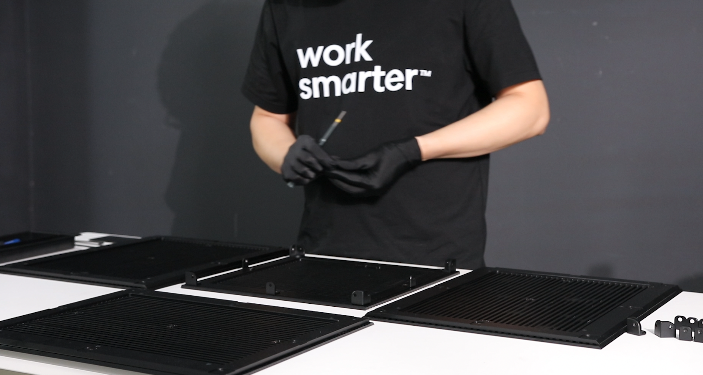 |
| 2 | Attach the first side to the base. | 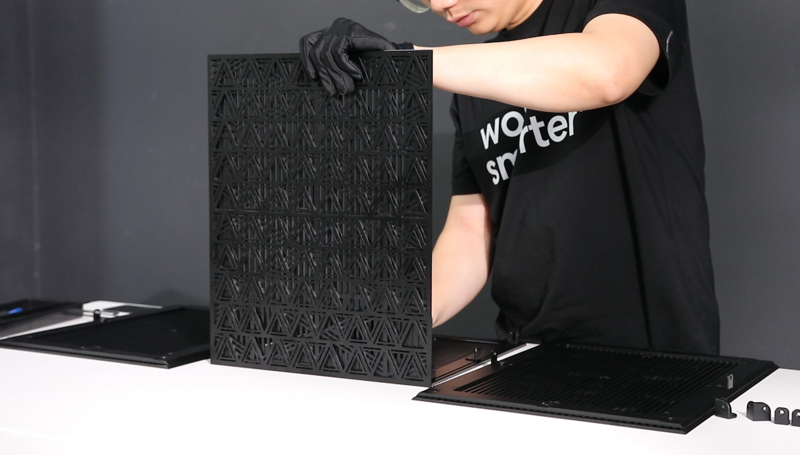 |
| 3 | Attach the other side to the base. | 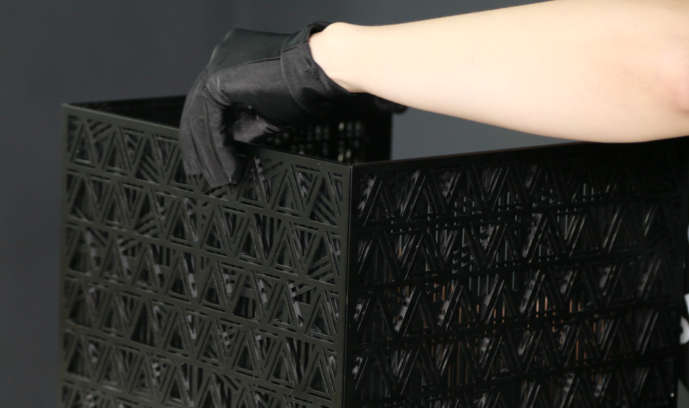 |
| 4 | Attach the top to the housing. | 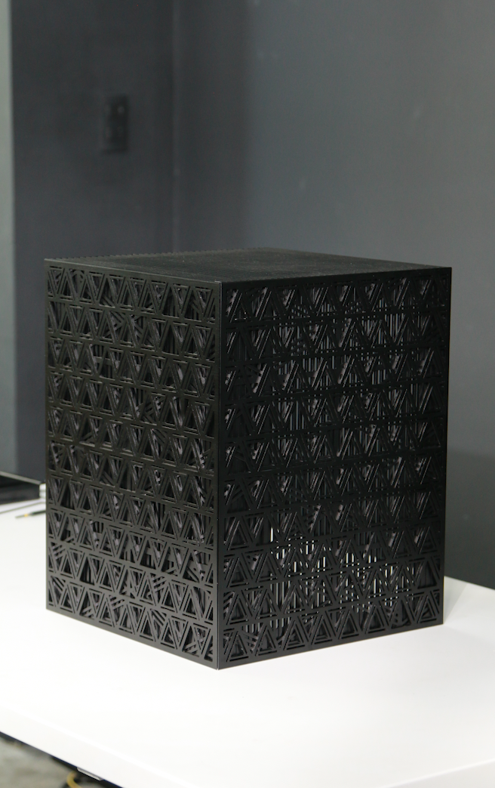 |
| 5 | Attach the brass hex standoffs to the back side. | 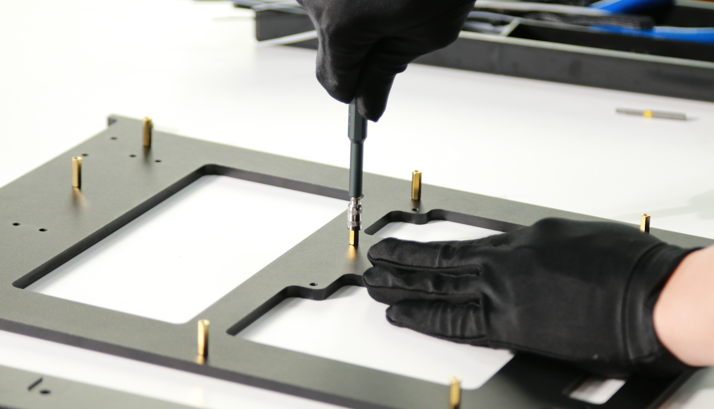 |
| 6 | Mount the PCIe risers to the mount plate. | 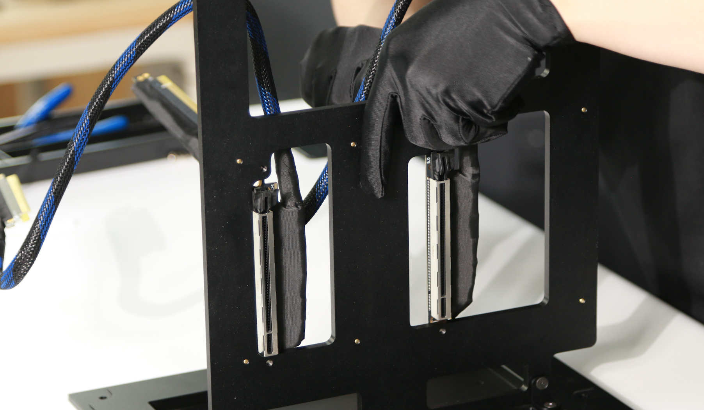 |
| 7 | Attach the fan plate to the mount. | 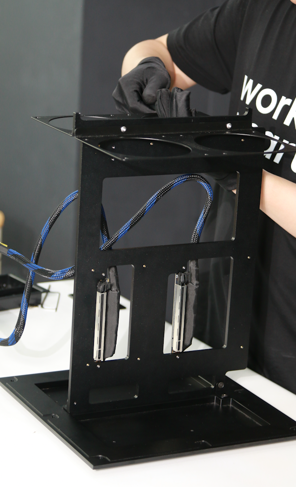 |
| 8 | Mount the fans to the fan plate. |  |
| 9 | Place the motherboard on the mount. |  |
| 10 | Screw the motherboard down to the mount. |  |
| 11 | Connect the PCIe risers to the motherboard. |  |
| 12 | Seat the GPUs in the riser slots. | 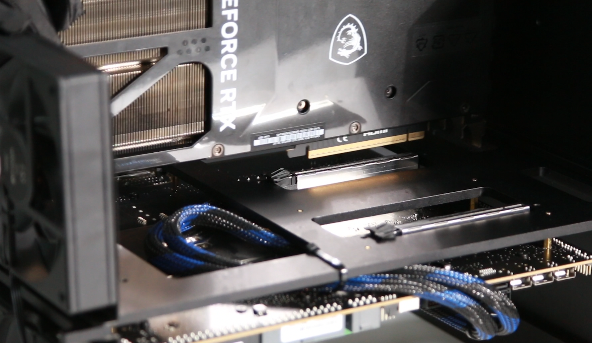 |
| 13 | Screw the GPUs down to the mount. | 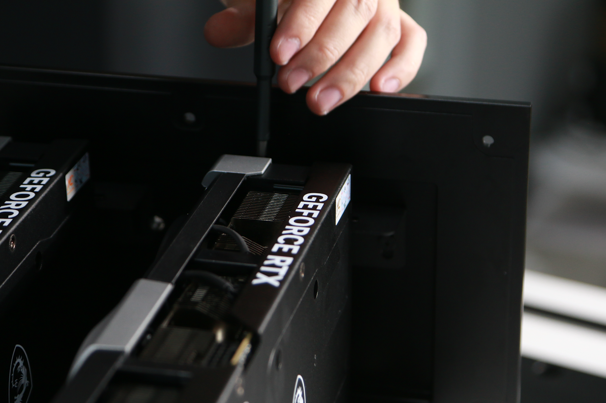 |
| 14 | Attach the PSU to the base. | 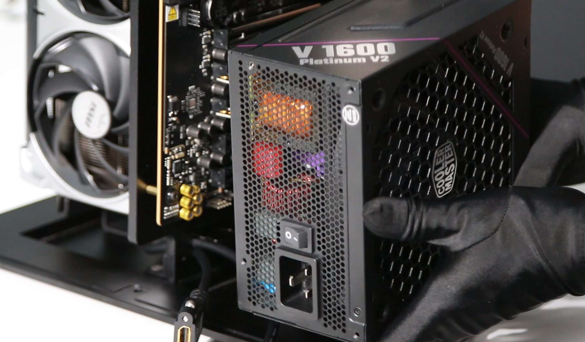 |
| 15 | Connect the cables on the PSU side. |  |
| 16 | Connect the ATX cable to the motherboard. | 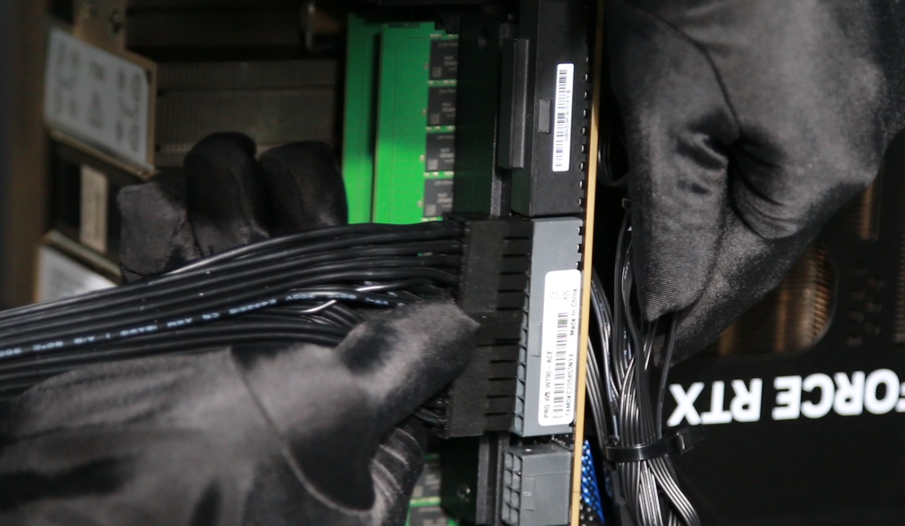 |
| 17 | Connect the 8-pin connector to the motherboard. |  |
| 18 | Connect the CPU fan to the motherboard. |  |
| 19 | Connect the 12-pin power cables to the GPUs. | 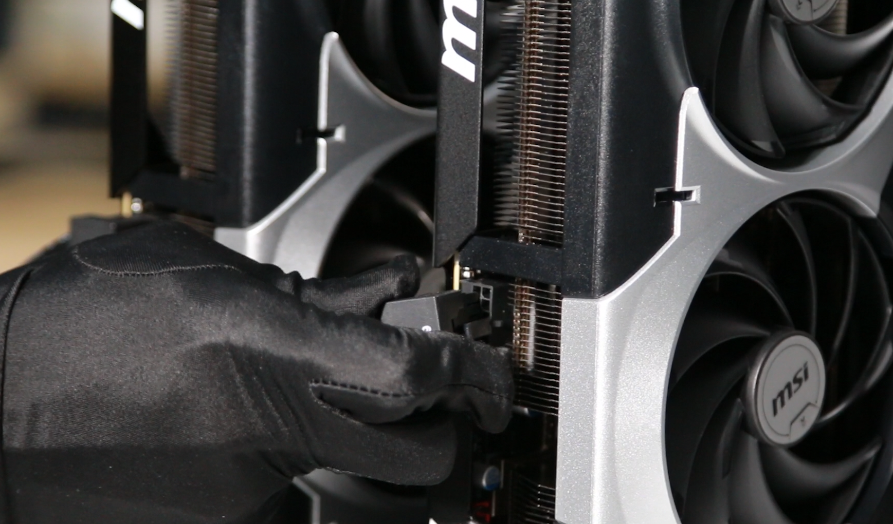 |
| 20 | All electronics installed. |  |
| 21 | Attach one side panel of the housing. | 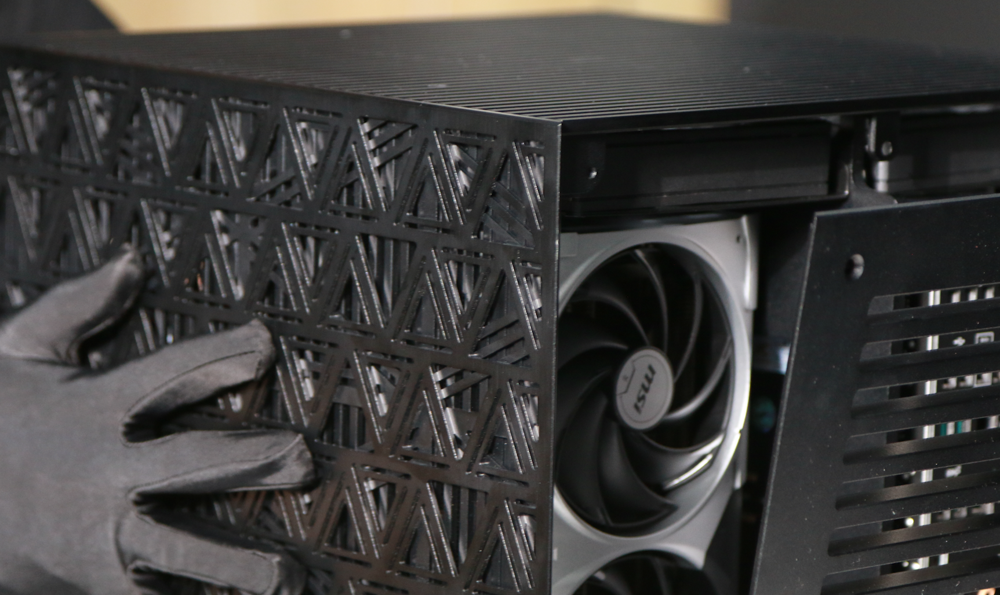 |
| 22 | Attach the other side panel. | 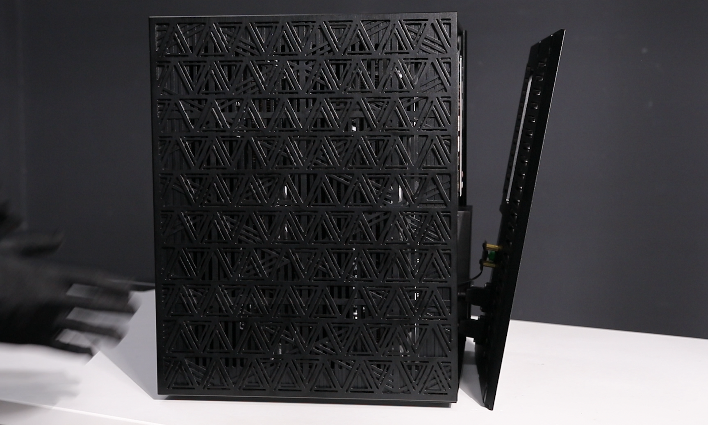 |
| 23 | Fit the final panel — done. | 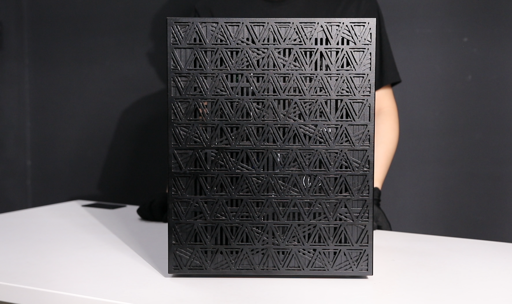 |

---