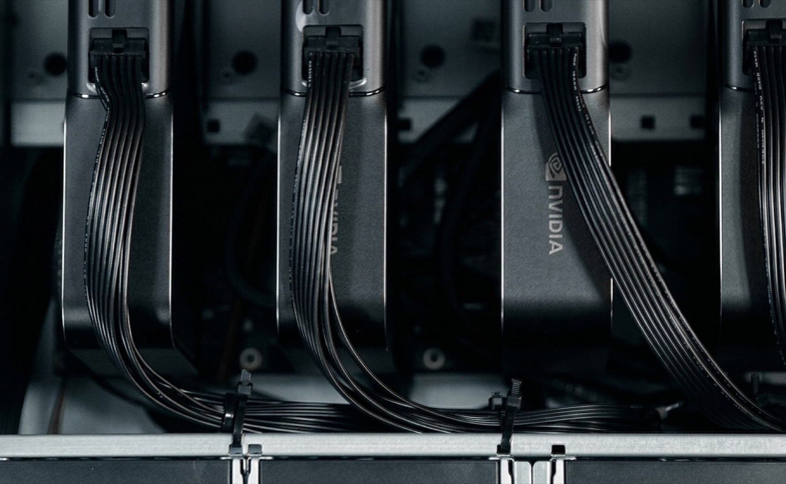
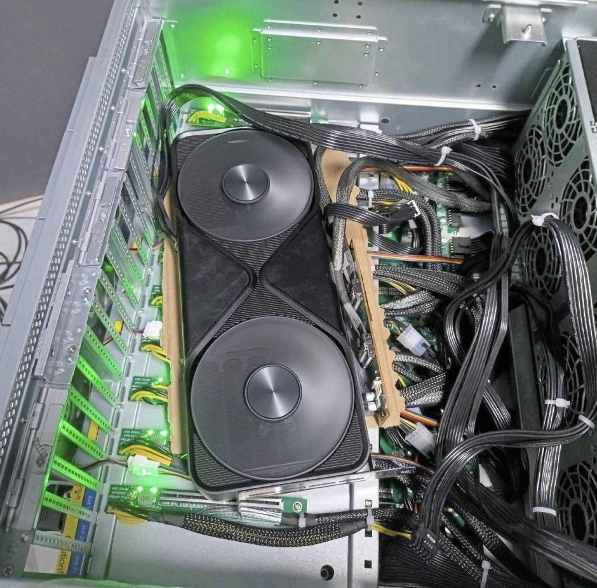
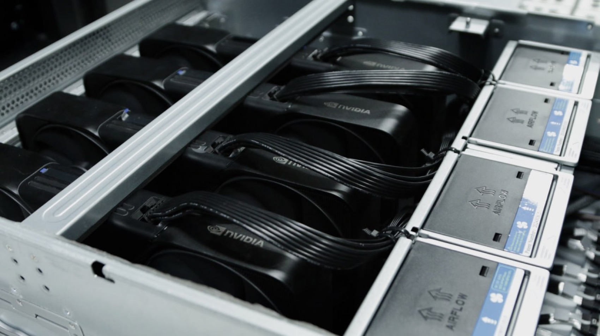
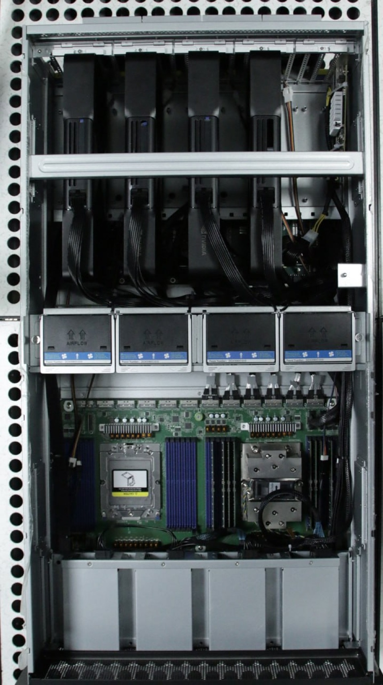
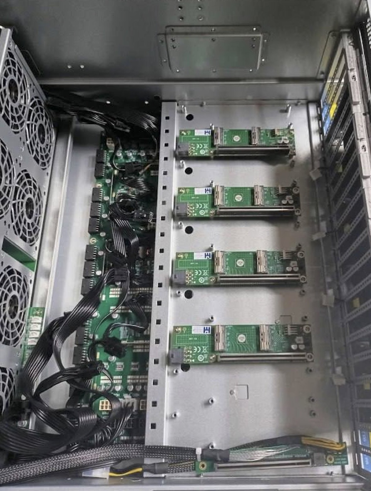
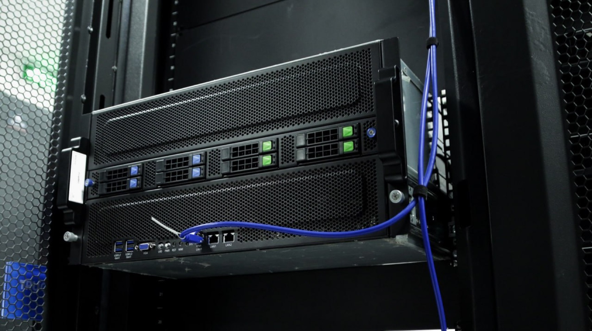

# 4× NVIDIA RTX PRO 6000



The server build — rack-ready for on-prem and the data center: four RTX PRO 6000 Blackwell GPUs on an AMD EPYC platform in a 5U chassis. 384 GB of VRAM: fine-tune and serve the biggest open models to a whole team.

- **4× NVIDIA RTX PRO 6000 Blackwell** — 384 GB GDDR7 ECC · 7,168 GB/s (96 GB per card)
- **AMD EPYC 9124** (ASRock Rack TURIN2D24G-2L+) · 384 GB DDR5 ECC · 1 TB NVMe
- **PCIe Gen 5 ×16** per GPU, over MCIO · BMC
- **3× 2,000 W** CRPS
- **5U rack chassis**

## Build it

1. **Parts** — the [bill of materials](bom/bom.md), with a photo of every part; lay them all out and check them off.
2. **Housing** — the [5U chassis kit](docs/prepare-me.md) ships complete.
3. **Assemble** — the [step-by-step assembly guide](docs/assembly.md), 13 steps from bare chassis to first boot.
4. **BIOS, drivers, testing** — the shared [BIOS tuning and GPU testing](../setup.md) guide. Board-specific notes below.
5. **Serve your models** — [Grid](https://github.com/autonomous-ai/autonomous-grid), the open orchestrator for local AI, or any local AI engine: vLLM, Ollama, llama.cpp.

<table>
<tr>
<td width="50%"></td>
<td width="50%"></td>
</tr>
<tr>
<td width="50%"></td>
<td width="50%"></td>
</tr>
</table>

## Inside the machine

<table>
<tr>
<td width="50%"></td>
<td width="50%"></td>
</tr>
<tr>
<td width="50%"></td>
<td width="50%"></td>
</tr>
</table>

## BIOS notes and testing

The TURIN2D24G-2L+ feeds the GPUs over MCIO, so link width is the setting that matters most (the general list is in [the setup guide](../setup.md)):

```
Advanced -> Chipset Configuration -> PCIE link width
  -> set the MCIO pairs feeding the 4 GPUs to Gen5 x16
Advanced -> PCI Subsystems Settings -> Enable Re-size BAR support
```

Above 4G Decoding is typically enabled by default on this platform — verify it. For exact menu locations, see ASRock Rack's motherboard and BMC manuals for the TURIN2D24G-2L+.

Then make sure all four cards are detected, report full VRAM, and link at full PCIe width — the checklist is in [the setup guide](../setup.md#gpu-testing).

## Serve your models

The rig runs, now put it to work. The easiest way is [Grid](https://github.com/autonomous-ai/autonomous-grid), the open orchestrator for local AI: it pools your machines into one local AI network. Or run any local AI engine — vLLM, Ollama, llama.cpp.

```bash
curl -fsSL https://grid.autonomous.ai/install.sh | bash
```


## The finished machine

<table>
<tr>
<td width="50%"></td>
<td width="50%"></td>
</tr>
</table>

## Discussion

Alternative build options brainstormed before settling on this baseline — Turin upgrade path, single-socket variants, and a 3× H100 PCIe alternative — with verification notes: [brainstorm & discussion](docs/discussion.md).

## Other builds

The [2× 5090](../2x-5090/README.md) (start tonight), the [4× 5090](../4x-5090/README.md) (the team build), and the [8× 5090](../8x-5090/README.md) (on-prem scale) scale the same idea down and up.

## License

Open source under the [MIT License](../LICENSE).
