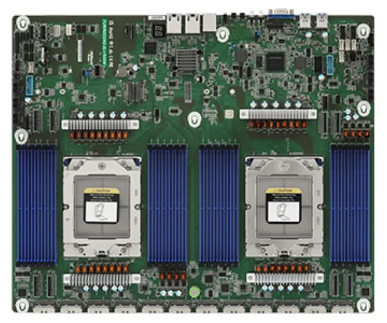
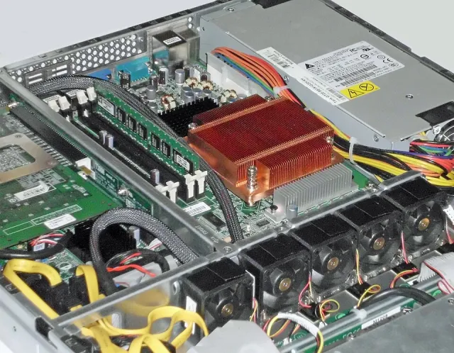
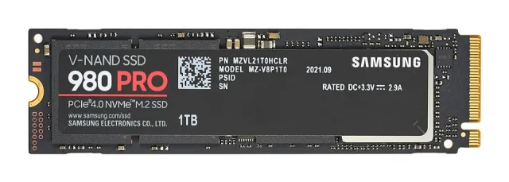
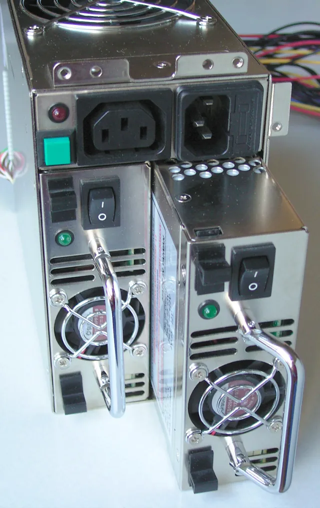
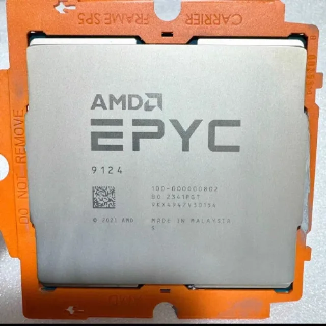
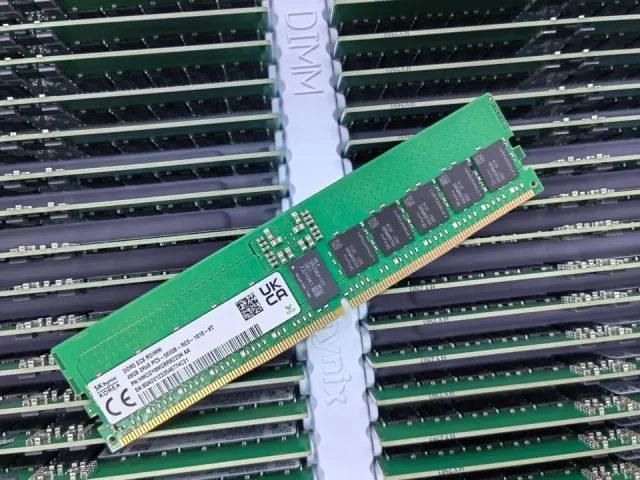
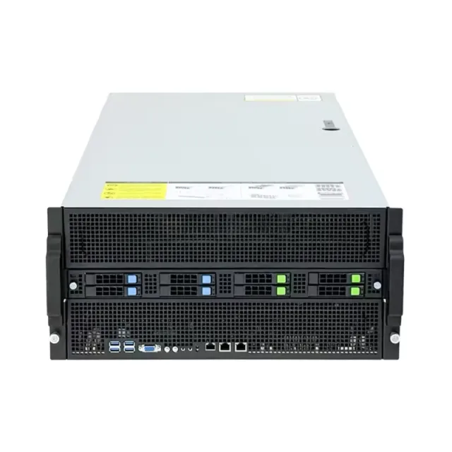

# Bill of Materials

Quantities are **per server** — one 5U chassis with 4× RTX PRO 6000 GPUs. Lay every part out and check it off before assembly.

> Component photos are representative product images (the GPUs are from this build). Exact parts are listed in the table below.

<table>
    <tr>
        <td valign="top" align="center" width="50%">
            <b>1. Mainboard — ASRock Rack TURIN2D24G-2L+</b> 
             
            <b>3. CPU heatsink — COOLSERVER 2U SP5 S22</b> 
             
            <b>5. SSD — Samsung 990 EVO Plus 1 TB NVMe</b> 
             
            <b>7. PSU — Changcheng 2000 W CRPS (×3)</b> 
             
        </td>
        <td valign="top" align="center" width="50%">
            <b>2. CPU — AMD EPYC 9124</b> 
             
            <b>4. RAM — DDR5 ECC RDIMM 48 GB (×8)</b> 
             
            <b>6. GPU — NVIDIA RTX PRO 6000 (×4)</b> 
             
            <b>8. 5U case — ASRock 5U850 Gen5</b> 
             
        </td>
    </tr>
</table>

## Details

| No  | Item         | Detail                                                                                                                                | Qty | Category      | Notes                                                                                |
|:---:|:-------------|:--------------------------------------------------------------------------------------------------------------------------------------|:---:|:--------------|:-------------------------------------------------------------------------------------|
|  1  | Mainboard    | ASRock Rack TURIN2D24G-2L+ / 500W                                                                                                     |  1  | Mainboard     | Dual SP5; designed for EPYC 9005 (Turin) — confirm 9004 (Genoa) BIOS support for 9124 |
|  2  | CPU          | AMD EPYC 9124                                                                                                                         |  1  | Processor     | 16C/32T Zen4, SP5, 200W (single-socket on a dual-socket board)                        |
|  3  | CPU Heatsink | COOLSERVER 2U AMD EPYC SP5 S22 — 6 heat pipes, L118 × W92.4 × H66.3 mm, PWM 2600–8000 RPM, 52.50 dB (max), 47.20 CFM, 4-pin PWM, 380 W |  1  | Cooling       |                                                                                      |
|  4  | RAM          | DDR5 ECC RDIMM 48 GB @ 5600 MT/s                                                                                                      |  8  | Memory        | 384 GB total                                                                          |
|  5  | SSD          | Samsung 990 EVO Plus 1TB NVMe                                                                                                         |  1  | Storage       |                                                                                      |
|  6  | GPU          | NVIDIA RTX PRO 6000 Blackwell Workstation Edition (reference board 900-5G144-2200-000)                                                |  4  | Graphics Card |                                                                                      |
|  7  | PSU          | Changcheng (Great Wall) 2000W CRPS                                                                                                    |  3  | Power Supply  | 6000W total                                                                           |
|  8  | 5U Case      | ASRock 5U850 Gen5 chassis (case, cable harness, power board included) — supports up to 8 GPUs, populated with 4                       |  1  | Housing       |                                                                                      |
