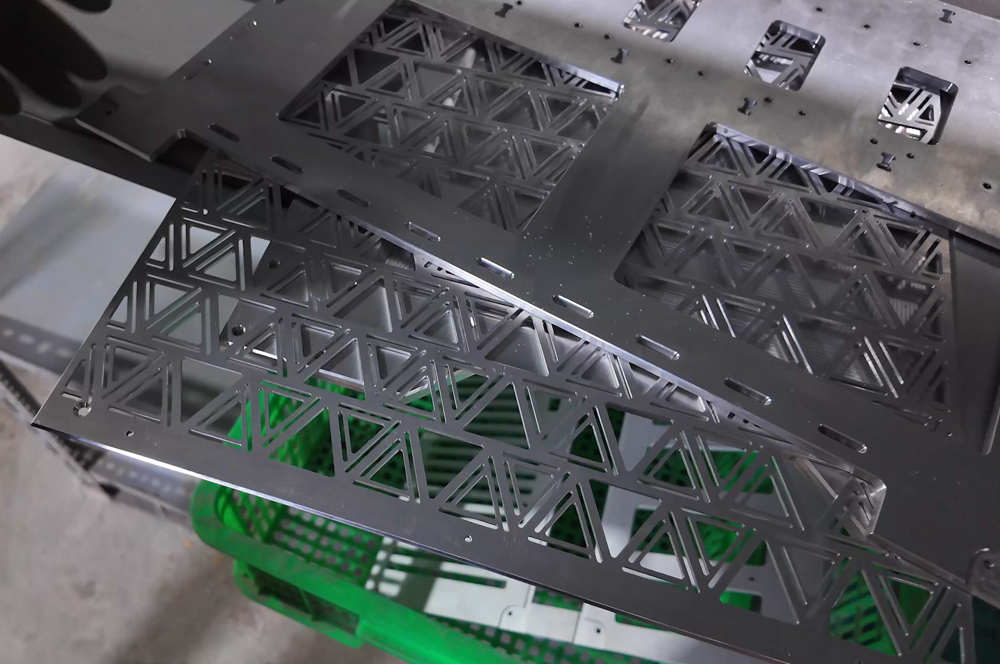
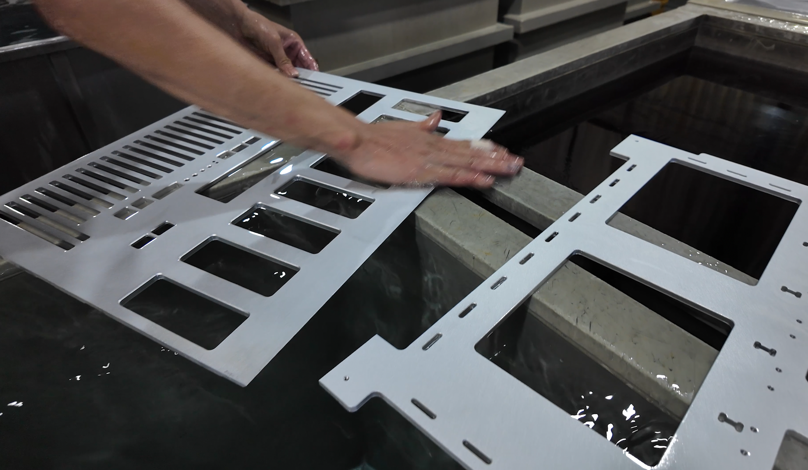
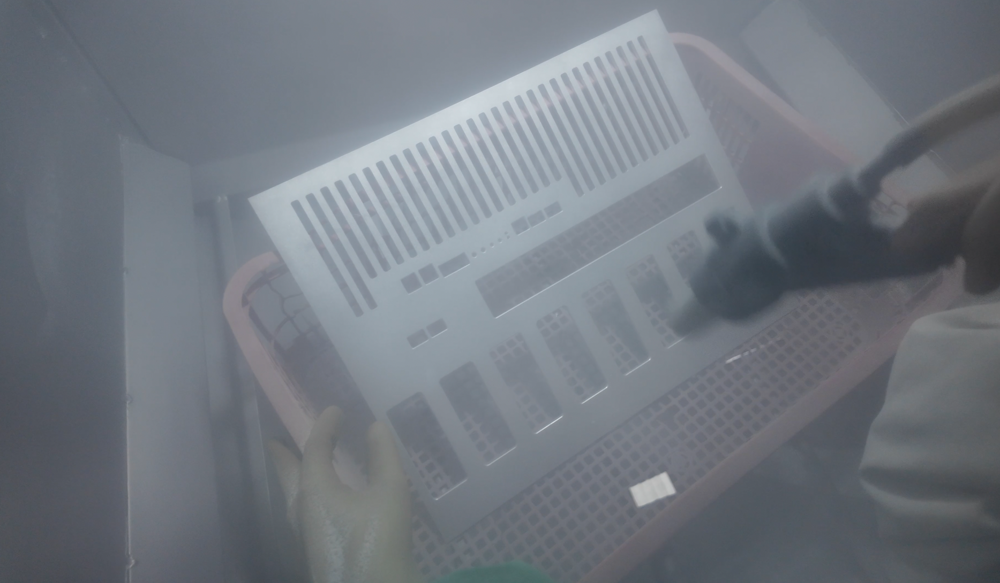
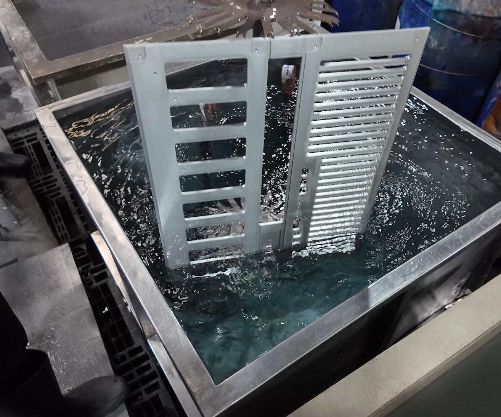

# Preparation — Mechanical & Housing

The housing is CNC-milled aluminum from the [STEP files](../step_models), then sand-blasted and anodized.

<table>
    <tr>
        <td valign="top" align="center" width="50%">
            <b>1. CNC milling</b> 
             
            <b>3. Anodizing</b> 
             
        </td>
        <td valign="top" align="center" width="50%">
            <b>2. Sand blasting</b> 
             
            <b>4. Anodized parts</b> 
             
        </td>
    </tr>
</table>

    <video src="https://github.com/user-attachments/assets/05ee937c-a871-4809-914b-d98930b31777"></video>

Next: [assembly](assembly.md).
