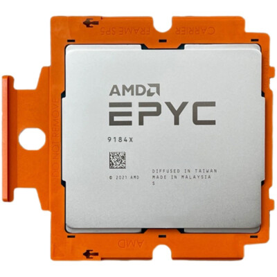
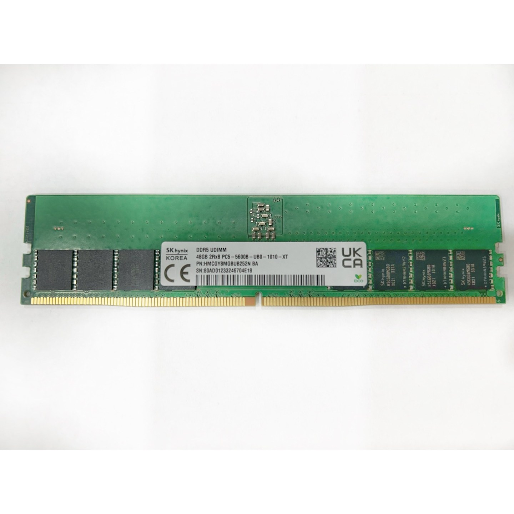
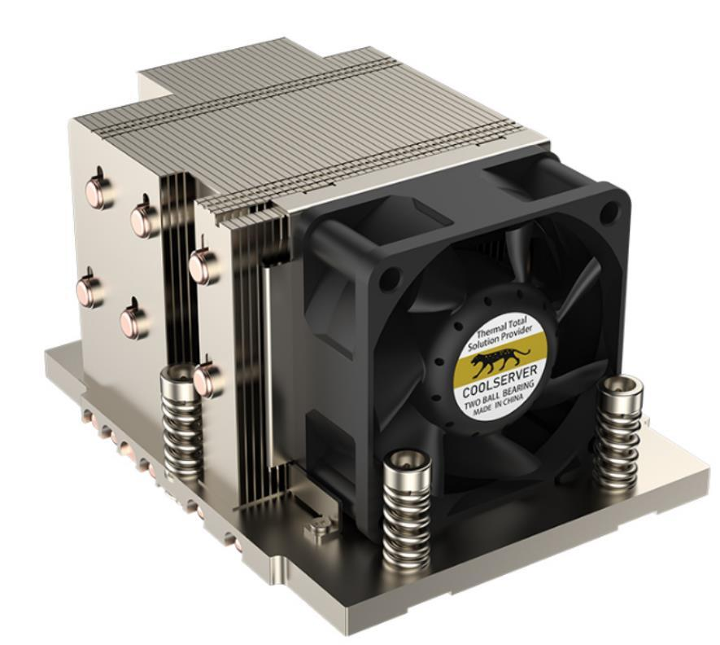
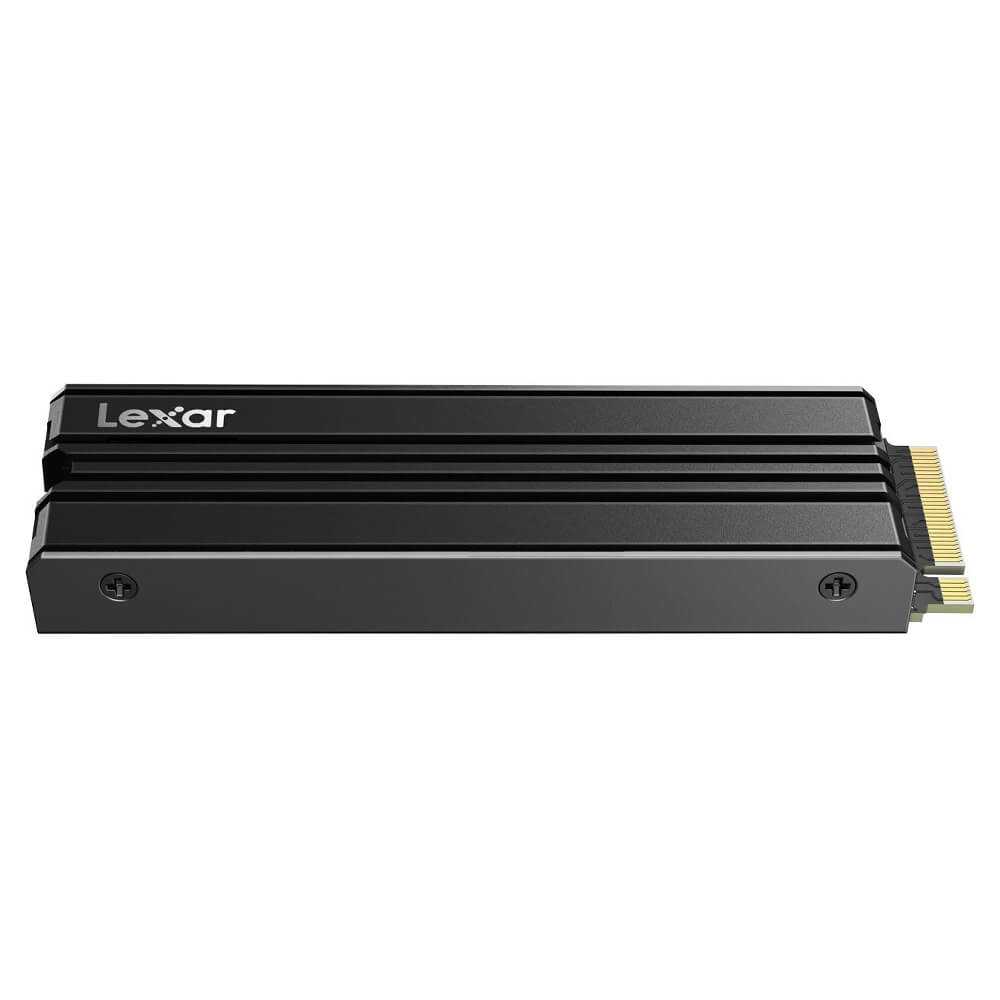
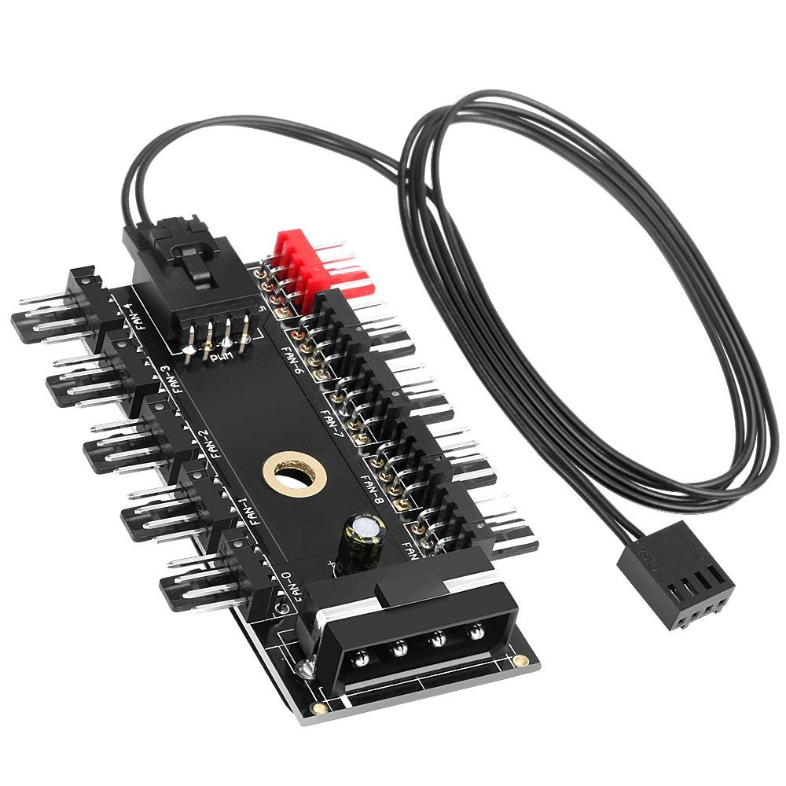

| No  | Item                      | Qty   | Category        | Photo                                                                 | Notes                   |
|:---:|:-------------------------:|:-----:|:---------------:|:---------------------------------------------------------------------:|:-----------------------:|
|  1  | Motherboard               |  1    | Mainboard       | |                         |
|  2  | CPU 9004 (SP5 Socket)     |  2    | Processor       |                            | SP5 Socket              |
|  3  | RAM DDR5                  |  4    | Memory          |                       | Configurable (1–24)     |
|  4  | SSD (1TB)                 |  1    | Storage         |                            | 1TB (configurable)      |
|  5  | MCIO Cable                |  16   | Cable           |              |                         |
|  6  | MCIO-PCIe Adapter         |  8    | Adapter         |          |                         |
|  7  | CPU Heatsink              |  2    | Cooling         |          |                         |
|  8  | Power Cable (Motherboard) |  1    | Cable           |   | 1 set                   |
|  9  | Power Supply Units (PSU)  |  4    | Power Supply    |                            | Total 8000W             |
| 10  | PSU Board                 |  1    | Power Board     |              |                         |
| 11  | GPUs                      |  8    | Graphics Card   |                            |                         |
| 12  | M.2 Heatsink              |  1    | Cooling         |          |                         |
| 13  | Fan                       |  12   | Cooling         |                            |                         |
| 14  | Fan Hub                   |  1    | Cooling         |                    |                         |
| 15  | GPU Power Cable (600W)    |  8    | Cable           |    | 600W option             |
| 16  | Frame housing             |  1    | housing         |-                                                                      | full                    |

