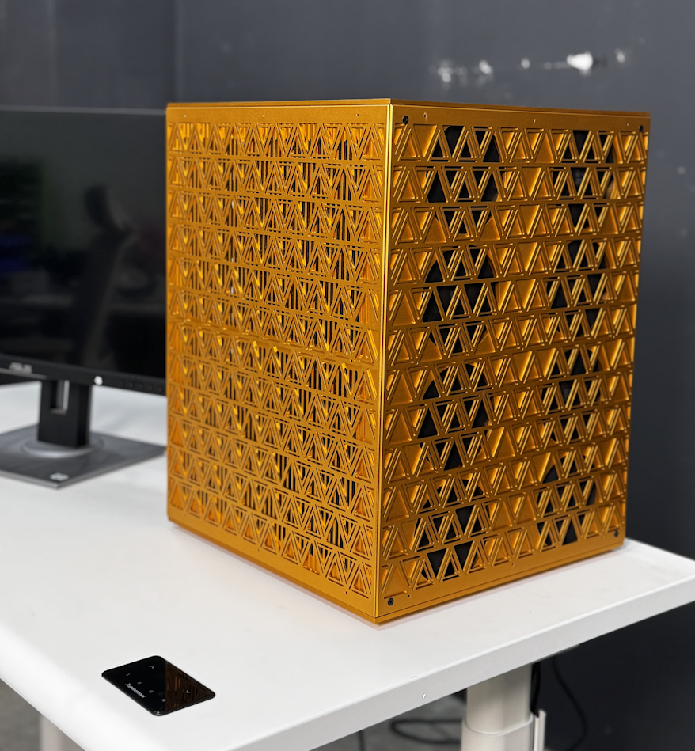
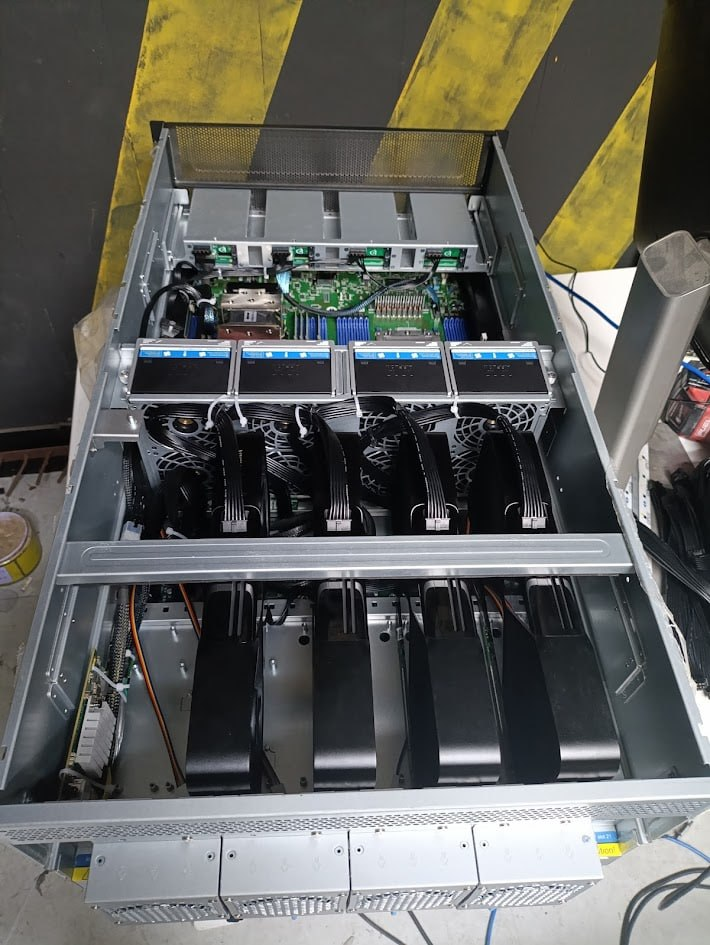

# Autonomous Computer: Build Your Own Personal AI Computer


https://github.com/user-attachments/assets/551abf33-336d-4426-9765-87c5528e53cb


<div align="center">


</div>

---

<div align="center">
    <b><i>
        This guide shows you how to build a Personal AI Computer with 2x / 4x / 8x GPUs. From hardware selection to software setup, follow each step to create a high-performance platform for deep learning, data science, and GPU-intensive workloads.
    </i></b>
</div>

---

## Table of Contents
- [Introduction](#introduction)
- [Preparation](#preparation)
- [Assembly](#assembly)
- [Setup](#setup)
- [Testing](#testing)
- [Bill of Materials](#bill-of-materials)
- [Other Builds](#other-builds)
- [License](#license)

---

## Introduction

<table>
    <tr>
        <td align="center" width="55%">
            <b><i>
                This tutorial is for anyone aiming to build their own Personal AI Computer with 2x / 4x/ 8x GPUs. Whether you're a researcher, developer, or enthusiast, you'll learn everything from hardware selection and assembly to system configuration and initial testing. Finish with a robust platform ready for demanding AI workloads.
            </i></b>
        </td>
        <td align="center" width="45%">
            
        </td>
    </tr>
</table>

---

## Preparation

### 1. [Electronic & Electrical](docs/Prepare_EE.md)

### 2. [Mechanical & Housing](docs/Prepare_ME.md)

---

## Assembly

[See detailed steps](docs/Assembly.md)

---

## Setup

### BIOS Optimization for GPU Performance

> **Tip:** The default BIOS settings may not deliver optimal performance for multi-GPU workloads. Adjust these parameters for best results:

- **PCIe Settings** <br>
    Set all PCIe slots to the highest supported speed (Gen4/Gen5) and configure bifurcation for your GPUs.<br>
    ```
    Advanced -> Chipset Configuration -> PCIE link width -> set MCIO2/1, MCIO4/3, MCIO6/5, MCIO8/7, MCIO12/11, MCIO14/13, MCIO16/15, MCIO18/17 to x16
    ```

- **Above 4G Decoding** <br>
    Enable "Above 4G Decoding" to address large GPU memory.<br>
    ```
    May be enabled by default
    ```

- **Resizable BAR** <br>
    Activate "Resizable BAR" for improved CPU-GPU data transfer.<br>
    ```
    Advanced -> PCI Subsystems Settings -> Enable Re-size BAR support
    ```

- **Power Management**<br>
    Disable unnecessary power-saving features (C-states, ASPM) that may throttle GPU performance.<br>
    `Optional`

- **Memory Configuration**<br>
    Set RAM to rated speed and enable XMP/DOCP profiles for max bandwidth.<br>
    `Optional`

- **Fan and Thermal Controls**<br>
    Adjust fan curves and thermal limits for optimal cooling.<br>
    `Optional`

After saving changes, reboot and monitor GPU performance and stability.

**References:**
- [Motherboard User Manual](docs/UM_motherboard.pdf)
- [BMC Documents](docs/UM_BMC.pdf)

<p align="center">
    <!-- Upload How-to-set-up-BIOS.mp4 to this repo and replace this line with the video tag -->
</p>

---

## Testing

Boot with WinPE from USB to verify hardware, or install Linux, NVIDIA drivers, and check with `nvtop`. Once confirmed, install your OS and start your AI work.

<table>
    <tr>
        <td align="center">
            <br>
        </td>
        <td align="center">
            <br>
        </td>
    </tr>
</table>

<p align="center">
    <!-- Upload Booting.mp4 to this repo and replace this line with the video tag -->
</p>

---

## Bill of Materials

- [Bill of Materials](bom/BOM.md)

---

## Other Builds

<table>
    <tr>
        <td align="center" width="50%">
            <a href="2x-rtx5090/README.md">
                
            </a>
            <br><b>2× RTX 5090</b> — Intel Xeon W5 + ASUS W790<br>
            <a href="2x-rtx5090/README.md">View Build Guide →</a>
        </td>
        <td align="center" width="50%">
            <a href="4x-rtx-pro-6000/README.md">
                
            </a>
            <br><b>4× RTX PRO 6000 Blackwell</b> — AMD EPYC 9124 + ASRock Rack<br>
            <a href="4x-rtx-pro-6000/README.md">View Build Guide →</a>
        </td>
    </tr>
</table>

---

## License

This project is open source under the [MIT License](LICENSE).

---

<p align="center">
  <a href="https://git.io/typing-svg"></a>
</p>
