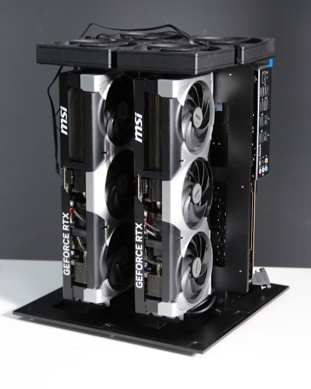
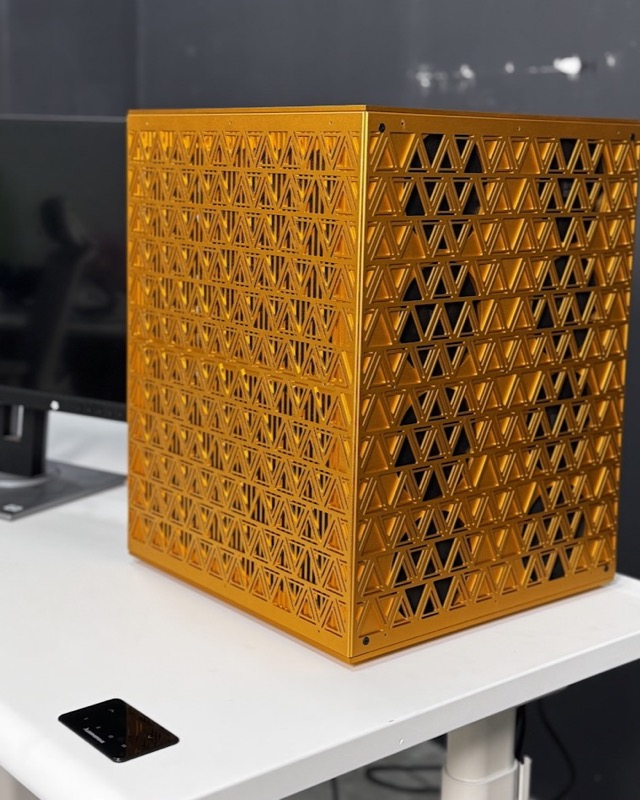

# Build your own Personal AI Computer

The best models live in someone else's cloud, behind someone else's terms and someone else's government — a model you rent can be cut off overnight; a model in your own house can't. These are open-source guides to build that machine: every part, every bracket, every BIOS setting, every assembly photo. Pick the size that fits your budget and your work. **Build it once; own it for good.**

https://github.com/user-attachments/assets/3e410e5d-83f4-4aed-a8b4-2426781f3ebd

## Quick start

1. **Pick a build** below by budget and the models you want to run.
2. **Source the parts** from that build's Bill of Materials.
3. **Make the housing** — print the STL files or CNC the STEP files in that build's folder.
4. **Assemble** — follow the build's photo-by-photo assembly guide.
5. **Set up the software** — drivers, BIOS, and serving open models locally: [`/software`](software/README.md).
6. **Run your intelligence** — point your agent at `localhost` and never get cut off again. Running more than one machine? [**Grid**](https://github.com/autonomous-ai/autonomous-grid) gives them all one endpoint.

## Hardware: Pick your build

There's a build for every budget and use case. Each is a complete, self-contained guide: bill of materials, housing files, wiring, BIOS, and assembly photos.

<table>
<tr>
<td align="center" width="33%">
<a href="builds/2x/README.md"></a><br><br>
<a href="builds/2x/README.md"><b>2× — Home</b></a>
</td>
<td align="center" width="33%">
<a href="builds/4x/README.md"></a><br><br>
<a href="builds/4x/README.md"><b>4× — Team</b></a>
</td>
<td align="center" width="33%">
<a href="builds/8x/README.md"></a><br><br>
<a href="builds/8x/README.md"><b>8× — On-prem business</b></a>
</td>
</tr>
</table>

## Software

### Set up the box

Bringing the box to life — OS, NVIDIA drivers, BIOS tuning, serving open models (Ollama / vLLM / llama.cpp), and connecting an agent: [**`/software`**](software/README.md). *(Setup and testing are documented today; local model-serving guides are in progress.)*

### Manage the box

Once the box serves a model, [**Grid**](https://github.com/autonomous-ai/autonomous-grid) is how you run it day to day. Grid is our open-source orchestration layer for local AI: it pools the computers you already own — this rig, your Mac, the workstation in the corner — behind **one OpenAI-compatible endpoint** and routes each request to whichever machine is running the right model. Your inference servers (Ollama, vLLM, llama.cpp, LM Studio, MLX) stay exactly where they are; Grid ties them together, on your local network or remotely.

```bash
curl -fsSL https://grid.autonomous.ai/install.sh | bash
```

It's a big project with its own repo — quickstart, CLI reference, and how it works: [**autonomous-ai/autonomous-grid**](https://github.com/autonomous-ai/autonomous-grid).

## Contributing

Built one? Improved a part? Found a better component? See [**CONTRIBUTING.md**](CONTRIBUTING.md) — and [share your build](https://github.com/autonomous-ai/autonomous-computer/issues/new?template=share-your-build.md). The best community builds get featured.

## License

Open source under the [MIT License](LICENSE). Fork it, change it, build your own and sell it — we just want it built.

---

<div align="center">
<b>Autonomous</b> — the AI hardware company.<br>
Questions? <a href="https://github.com/autonomous-ai/autonomous-computer/issues">Open an issue.</a>
</div>
