# Time to build your own Personal AI Computer

https://github.com/user-attachments/assets/36f7aa02-42ac-4b35-b757-a5dd3b43ef1a

## The future of AI is local

AI in 2026 looks like computing in 1975: the intelligence lives in a few mainframes, owned by a few companies, and you rent it by the token. Everyone knows how that movie ends. The machine moves onto the desk — and the people who own their machines build everything that comes next.

The Personal AI Computer is that machine. The models are good, the GPUs are affordable, and homes and businesses are reaching the same answer: bring it in-house. Three reasons:

1. **No one can switch you off.** In June 2026 the US government took Fable 5 offline for most of a month and gated GPT-5.6 behind an approved-partner list. Weights on your own disk can't be revoked.
2. **Your business is their training data.** Every prompt you send OpenAI or Anthropic carries your product, your process, your edge. They will turn your secret sauce into their product.
3. **Inference becomes free.** Open weights on a cloud API already cut the bill 20–30×. On your own machine there is no bill at all. No API, no meter.

## The end-to-end open-source local AI stack

Open software lets you run and shape your AI; open hardware lets you build, repair, and improve the machine it runs on. With both in your hands — the code, the CAD, the BOM, the BIOS settings — you can build the whole thing end to end. So we open-source both:

- **Hardware — this repo.** Your Personal AI Computer in four sizes, below: every part, every bracket, every BIOS setting, every assembly photo.
- **Software — your choice.** Run any local AI framework — vLLM, Ollama, llama.cpp — or [Grid](https://github.com/autonomous-ai/autonomous-grid), our local AI orchestrator.

## 2× NVIDIA RTX 5090

The entry-level build, for personal use. Enough for Llama, Qwen, and DeepSeek with quantization — run OpenClaw, Hermes Agent, or your own LangChain stack locally.

- **2× NVIDIA RTX 5090** — 64 GB VRAM · 3,584 GB/s · 419 FP32 TFLOPS
- **Intel Xeon W5** (ASUS W790 ACE) · 96 GB RAM · 1 TB NVMe
- **PCIe Gen 5 ×16** per GPU · 10 GbE + 2.5 GbE
- **1,550 W draw** · 1,600 W PSU
- **12.5″ × 12.5″ × 16″** · 33 lb

<a href="2x-5090/README.md">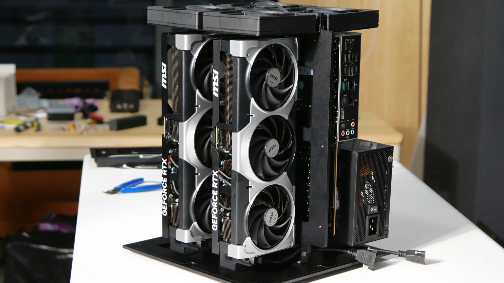</a>

<table>
<tr>
<td width="50%">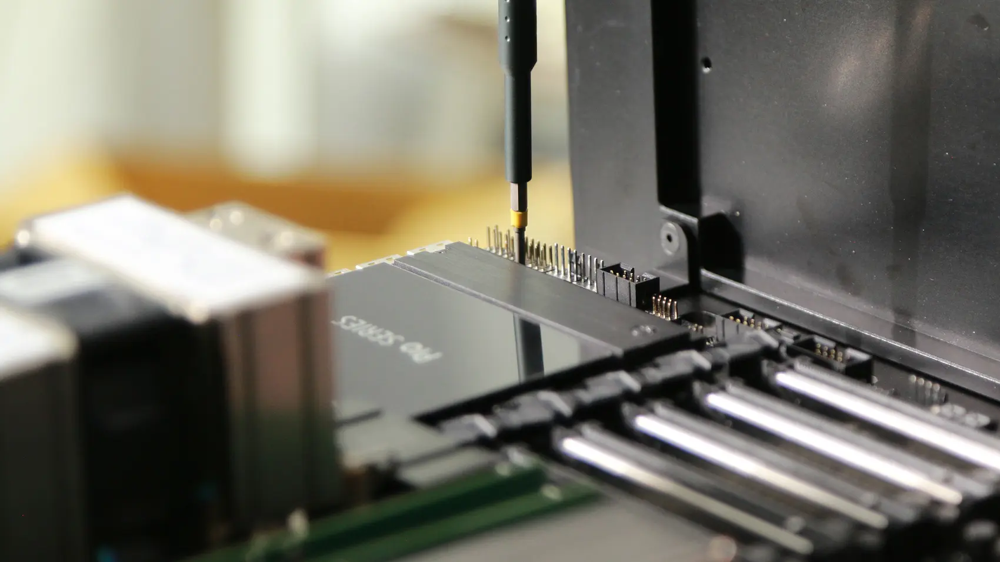</td>
<td width="50%">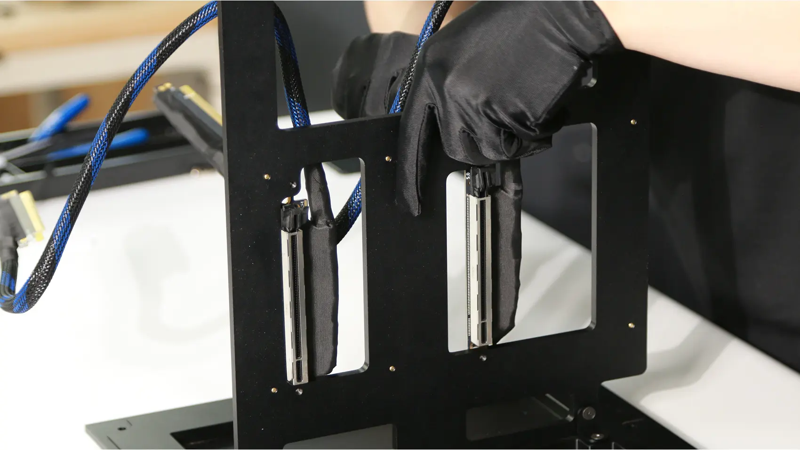</td>
</tr>
<tr>
<td width="50%">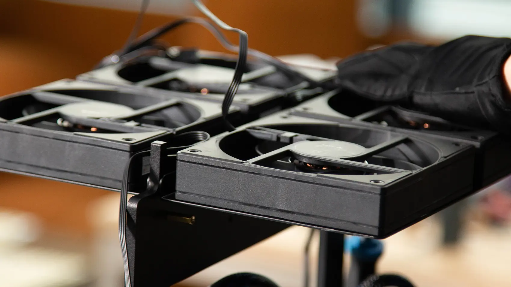</td>
<td width="50%">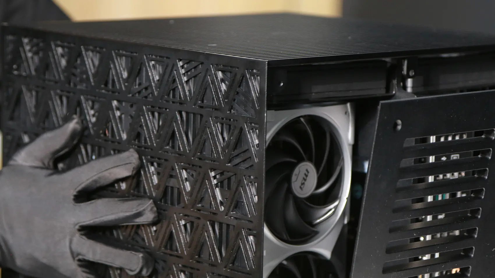</td>
</tr>
</table>

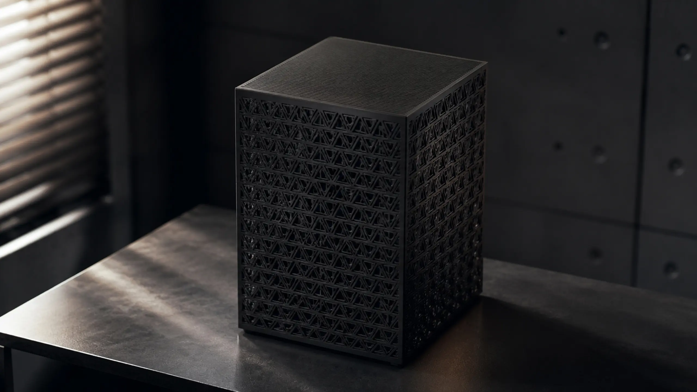

**[Build the 2× 5090 →](2x-5090/README.md)**

## 4× NVIDIA RTX 5090

The team build. Larger open models like Kimi, MiniMax, and GLM. No API bills. Low latency. Private data.

- **4× NVIDIA RTX 5090** — 128 GB VRAM · 7,168 GB/s · 838 FP32 TFLOPS
- **AMD Ryzen Threadripper Pro** · 96 GB RAM · 1 TB NVMe
- **PCIe Gen 5 ×16** per GPU · 2× 10 GbE · BMC
- **2,750 W draw** · 4,000 W PSU
- **15.5″ × 15.5″ × 16″** · 66 lb · dual-chamber airflow — intake below, GPUs above

<a href="4x-5090/README.md">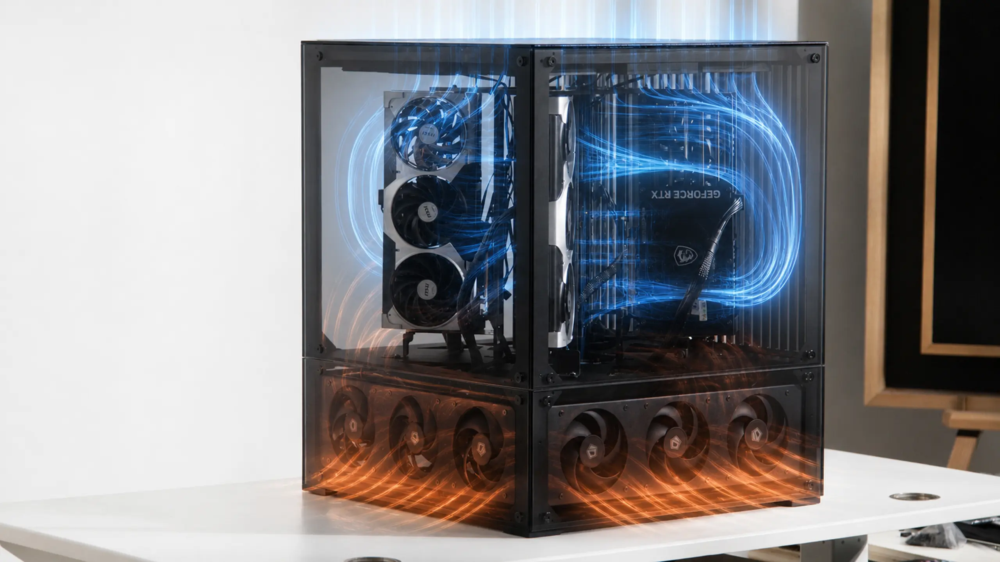</a>

<table>
<tr>
<td width="50%">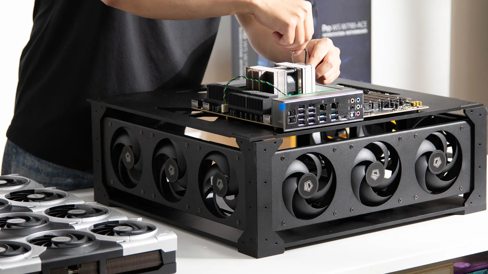</td>
<td width="50%">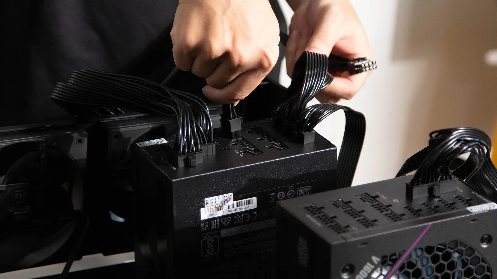</td>
</tr>
<tr>
<td width="50%">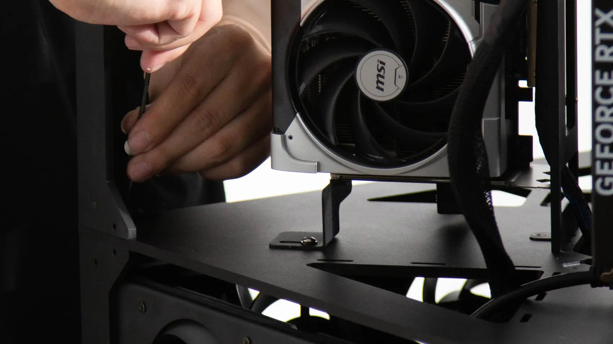</td>
<td width="50%">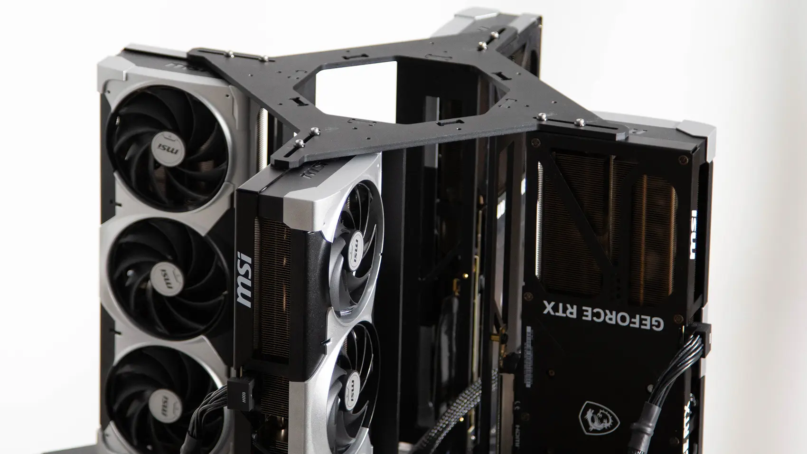</td>
</tr>
</table>

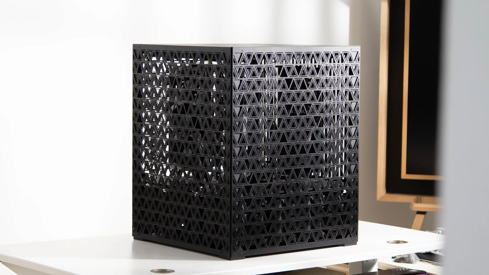

**[See the 4× 5090 →](4x-5090/README.md)**

## 8× NVIDIA RTX 5090

The on-prem build, for business. Develop, serve, and fine-tune with open models — the work that should never leave your floor.

- **8× NVIDIA RTX 5090** — 256 GB VRAM · 14,336 GB/s · 1,676 FP32 TFLOPS
- **2× AMD EPYC 9004** (ASRock Rack GENOA2D24G-2L+) · 192 GB RAM · 1 TB NVMe
- **PCIe Gen 5 ×16** per GPU, over MCIO · 2× 1 GbE · BMC
- **5,100 W draw** · 8,000 W PSU
- **15.5″ × 15.5″ × 24″** · 110 lb · CNC-milled anodized aluminum housing

<a href="8x-5090/README.md">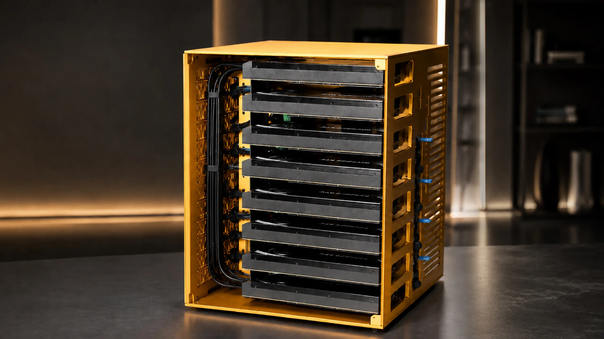</a>

<table>
<tr>
<td width="50%"></td>
<td width="50%"></td>
</tr>
<tr>
<td width="50%"></td>
<td width="50%"></td>
</tr>
</table>


**[Build the 8× 5090 →](8x-5090/README.md)**

## 4× NVIDIA RTX PRO 6000

The workstation build. Fine-tune and serve the biggest open models at full precision, without quantizing.

- **4× NVIDIA RTX PRO 6000 Blackwell** — 384 GB VRAM (96 GB per card)
- **AMD EPYC 9124** (ASRock Rack TURIN2D24G-2L+) · 384 GB DDR5 ECC · 1 TB NVMe
- **PCIe Gen 5 ×16** per GPU, over MCIO · BMC
- **3× 2,000 W** CRPS
- **5U rack chassis** — off the shelf, no CNC work

<a href="4x-6000/README.md"></a>

**[Build the 4× 6000 →](4x-6000/README.md)**

## Software

1. **[BIOS tuning and GPU testing](setup.md)** — multi-GPU BIOS settings, NVIDIA drivers, and confirming every GPU is detected, linked at full PCIe width, and stable under load.

   <a href="setup.md"></a>

2. **[Run Grid](https://github.com/autonomous-ai/autonomous-grid)** — Grid is our open-source orchestration layer for local AI: it pools the computers you already own — this rig, your Mac, the workstation in the corner — behind **one OpenAI-compatible endpoint** and routes each request to whichever machine is running the right model, on your local network or remotely.

   ```bash
   curl -fsSL https://grid.autonomous.ai/install.sh | bash
   ```

## Contributing

Built one? Improved a part? Found a better component? See [**CONTRIBUTING.md**](CONTRIBUTING.md) — and [share your build](https://github.com/autonomous-ai/autonomous-computer/issues/new?template=share-your-build.md). The best community builds get featured.

## License

Open source under the [MIT License](LICENSE). Fork it, change it, build your own and sell it — we just want it built.

---

<div align="center">
<b>Autonomous</b> — the AI hardware company.<br>
Questions? <a href="https://github.com/autonomous-ai/autonomous-computer/issues">Open an issue.</a>
</div>
