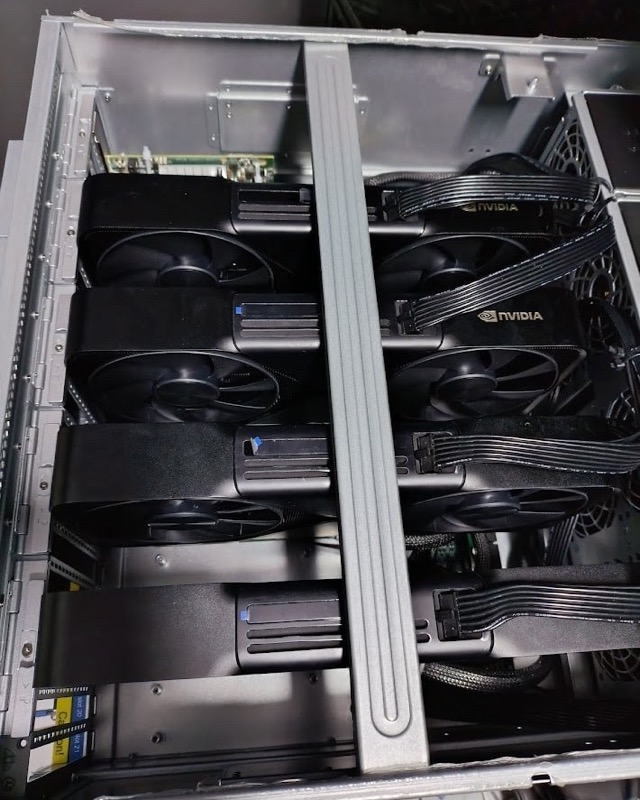

# Build your own Personal AI Computer

https://github.com/user-attachments/assets/36f7aa02-42ac-4b35-b757-a5dd3b43ef1a

**The future of AI is local.** Three reasons:

1. **No one can switch you off.** In June 2026 the US government took Fable 5 offline for most of a month and gated GPT-5.6 behind an approved-partner list. Weights on your own disk can't be revoked.
2. **Your business is their training data.** Every prompt you send OpenAI or Anthropic carries your product, your process, your edge. They will turn your secret sauce into their product.
3. **Inference becomes free.** Open weights on a cloud API already cut the bill 20–30×. On your own machine there is no bill at all. No API, no meter — electricity.

We built the whole stack, hardware and software, the way Apple does. Then we did what Apple never would — open-sourced it:

- **Hardware — this repo.** Your Personal AI Computer in three sizes: every part, every bracket, every BIOS setting, every assembly photo.
- **Software — your choice.** Run any local AI framework — vLLM, Ollama, llama.cpp — or run [Grid](https://github.com/autonomous-ai/autonomous-grid), ours: every machine you own behind one OpenAI-compatible endpoint.

**Own the means of production.**

## Quick start

1. **Pick a build** below by budget and the models you want to run — [2×](2x/README.md) · [4×](4x/README.md) · [8×](8x/README.md).
2. **Source the parts** from that build's Bill of Materials — [2×](2x/bom/bom.md) · [4×](4x/bom/bom.md) · [8×](8x/bom/bom.md).
3. **Make the housing** — print the STL files or CNC the STEP files — [2×](2x/stl-models) · [8×](8x/step_models). (The 4× uses an off-the-shelf 5U chassis.)
4. **Assemble** — follow the photo-by-photo assembly guide — [2×](2x/docs/assembly.md) · [4×](4x/docs/assembly.md) · [8×](8x/docs/assembly.md).
5. **Software** — [BIOS setup](setup.md), [GPU testing](testing.md), and [Grid](https://github.com/autonomous-ai/autonomous-grid).

## Hardware: Pick your build

There's a build for every budget and use case. Each is a complete, self-contained guide: bill of materials, housing files, wiring, BIOS, and assembly photos.

<table>
<tr>
<td align="center" width="33%">
<a href="2x/README.md"></a><br><br>
<a href="2x/README.md"><b>2× — Home</b></a>
</td>
<td align="center" width="33%">
<a href="4x/README.md"></a><br><br>
<a href="4x/README.md"><b>4× — Team</b></a>
</td>
<td align="center" width="33%">
<a href="8x/README.md"></a><br><br>
<a href="8x/README.md"><b>8× — On-prem business</b></a>
</td>
</tr>
</table>

At a glance:

| Build | GPUs | VRAM | Platform | Power | Housing |
|:---|:---|:---|:---|:---|:---|
| [**2× — Home**](2x/README.md) | 2× RTX 5090 | 64 GB | Intel Xeon W5 (ASUS W790 ACE) | 1× 1600 W | 3D-print or CNC it yourself |
| [**4× — Team**](4x/README.md) | 4× RTX PRO 6000 Blackwell | 384 GB | AMD EPYC 9124 (ASRock Rack TURIN2D24G-2L+) | 3× 2000 W | Off-the-shelf 5U chassis |
| [**8× — On-prem business**](8x/README.md) | 8× RTX 4090 / 5090 | 192–256 GB | 2× AMD EPYC 9004 (ASRock Rack GENOA2D24G-2L+) | 4× 2000 W | CNC-milled anodized aluminum |

## Software

1. **[Setup](setup.md)** — BIOS tuning for multi-GPU, NVIDIA drivers, and your OS.
2. **[Testing](testing.md)** — confirm every GPU is detected, linked at full PCIe width, and stable under load.
3. **[Run Grid](https://github.com/autonomous-ai/autonomous-grid)** — Grid is our open-source orchestration layer for local AI: it pools the computers you already own — this rig, your Mac, the workstation in the corner — behind **one OpenAI-compatible endpoint** and routes each request to whichever machine is running the right model, on your local network or remotely.

   ```bash
   curl -fsSL https://grid.autonomous.ai/install.sh | bash
   ```

## Contributing

Built one? Improved a part? Found a better component? See [**CONTRIBUTING.md**](CONTRIBUTING.md) — and [share your build](https://github.com/autonomous-ai/autonomous-computer/issues/new?template=share-your-build.md). The best community builds get featured.

## License

Open source under the [MIT License](LICENSE). Fork it, change it, build your own and sell it — we just want it built.

---

<div align="center">
<b>Autonomous</b> — the AI hardware company.<br>
Questions? <a href="https://github.com/autonomous-ai/autonomous-computer/issues">Open an issue.</a>
</div>
